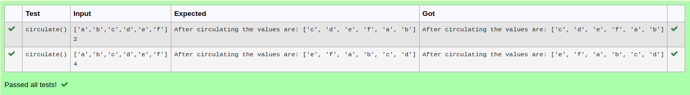

# Circulate-the-values-of-N-variables
## Aim:
To write a python program to circulate the n variables using function concept
## Equipment’s required:
PC
Anaconda - Python 3.7
## Algorithm: 
### Step 1:
Import def circulate.
### Step 2: 
Prepare the lists from each linear equations and assign in np.array().
### Step 3: 
Get the value from the user for the number of rotation
### Step 4: 
Using the slicing concept rotate the list
### Step 5:
 Get the value from the user for the number of rotation.
### Step 6:
 Using the slicing concept to rotate the list.
## Program:
```
#Program to circulate N values.
#Developed by:D.swathi 
#RegisterNumber:22003343
def circulate():
    l=eval(input())
    n=int(input())
    l=l[n:]+l[:n]
    print("After circulating the values are:",l)
```

## Output:


## Result:
Thus,the program to circulate the n variables using fuction is executed successfully.

